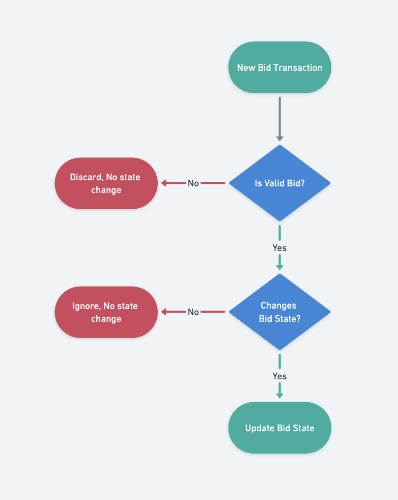
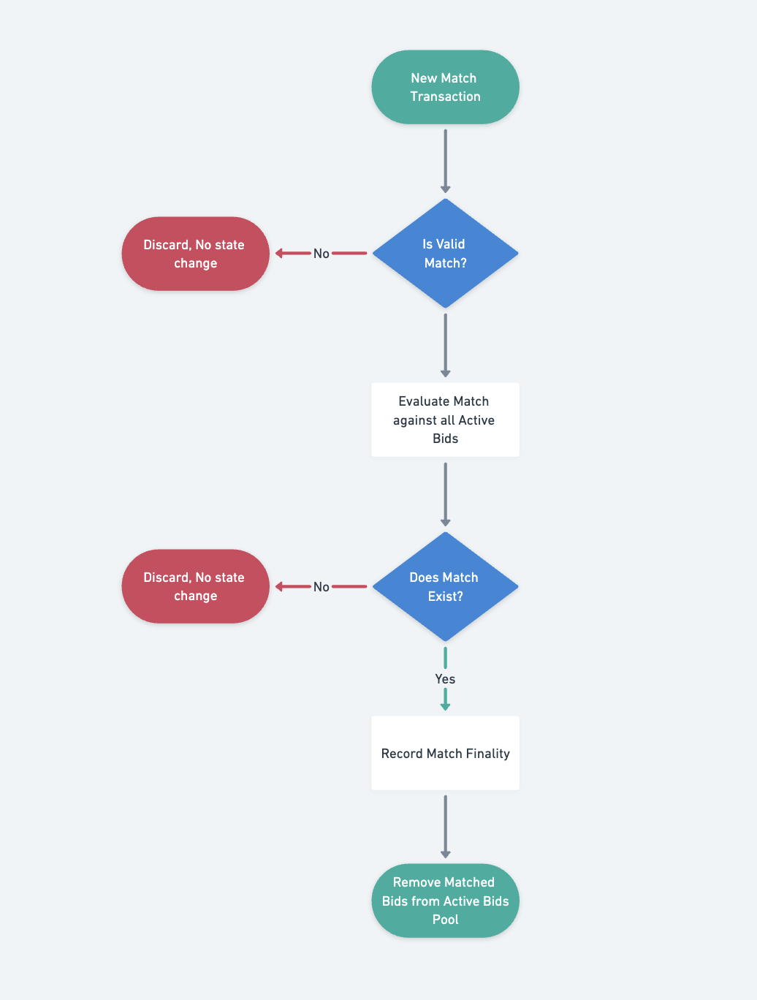

# Eve Engineering and Protocol Specification

A blockchain-based event-sourcing protocol for matching markets.

## Introduction

This is the specification for the Eve Platform. While we believe the use-cases for Eve have potential for a wide range of matching market and crowd-funding applications, events are the main focus of eve right now: you as the user can place a bid on an event you want to attend and once there are enough bids on the event, the event can make a match with you, provided your bid satisfies your constraints.

This system shares characteristics with the Event Sourcing pattern, where there is a clear seperation between writes and reads. Writes to the blockchain happen over the common Transaction where commitments are written to the memo field.

Later these memo fields are gathered and interpreted in a separate process (off-chain, or relayed to another smart contract). This allows for complete replay-ability and it is easy to verify computationally expensive processing, off-chain.

## Commitment States and Transactions

A Commitment is an expression of intent placed in the memo field of a transaction. These commitments can perform actions such as Create, Update, and Revoke a commitment. Commitments exist in 4 flavors:

- `bid` - A Bid is represents a bidding intent for participating in an Event as an attendee. It represents a bid that will convert to a ticket into the event system. The settles ticket value comes from the intersection of a `max_bid` from a bid and a `min_bid_amount` or, optionally, a bid can manifest as a “pledge” in which the bidder is committing to their `max_bid` regardless of the matching `min_bid_amount`
- `match` A Match represents an Event organizer’s **matching proposal** for an Event. A set of bids and/or pledges and an proposal match to create an Event in the events system.
- `intent` An intent is a non-binding declaration of intent.
- `system` - System is reserved for the behavior of the system declared by the DAO address. System is an on-chain expression used to define the behavior of the system from the moment that system commitments are submitted.

Each Transaction gives us a set of context that is useful for processing the context of a Memo Commitment. The Account ID, Transaction ID, Amount, and Memo fields are used in each commitment interpretation. One or more transactions from an account are used to construct the state of a commitment. This means that a valid bid, pledge, or proposal could be expressed in a single Transaction, or the Commitment can evolve over time, until a match is made

A `Commitment` is a transaction you make on the blockchain. Your wallet `id`, the amount of PHOTON you `stake`, and the `memo` you provide will get indexed and parsed into the eve system.

The notation for the `memo` is as follows: `<command>`, where `<command>` is defined to be `<memo_type>.<method>(<method_parameters>)`. Examples of commands are:

```go

// Example of a bid create and bid update.
eve.Bid("location:virtual", "organizer:btf", "dates:10-01-2025...10-10-2025")
eve.UpdateBid("42AB9335", "location:San Francisco")

// 
eve.Match("location:virtual", "dates:10-02-2025", "min_capacity:0", "min_bid_amount:50")

// Example of Revoking a bid
eve.RevokeBid("59FA93D5")
```

## Lexical Elements

Remember a `memo` := `<memo_type>.<method>(<method_parameters>)` and that memo came with an `<ID>` and a `<photon_amount>` which could be zero.

`<memo_type>` := a lexical token that is either “event” or “bid”

`<method>` := any method defined by event or bid (e.g., “Create”, “Update”, etc.)

`<method_parameters>` := the parameters passed into the method defined above

these parameters can be one of two lexical tokens: `<param_id>` and `<param_tag>`

`<param_id>`  := some methods needs an id, like Update, which needs the bid or event id of whom it will update the fields of. The `<param_id>`

`<param_tag>` := intent information is conveyed through tags. A tag is a label and that label defines a set of values that label could be. Three fundamental tags are are “location”, “org”, and “dates” so an event or bid can specify their intent on where the event is located, who is it hosted by, and dates that such an event would be possible.

## Memo Field Operations

Below are the prescribed operations of memo field operations. This section aims to outline the general behavior of how calls in the memo-field behave.

## General Behavior

- All Calls follow the structure of the Lexical Elements as expressed in the previous section.
  - Calls that create a “New” type, such as a new `Bid` , a new `Bid` or a new `Match` derive their unique identifier from the TXN hash of their submission
  - All other method parameters follow a “tagged” pattern in the form of `key:value`
- Defined `tags` have a specific expected behavior and are evaluated in a deterministic way, inputs such as `location` and `dates` have a specific syntax and format that are interpreted by the matching and verification systems
- Undefined `tags` are allowed and these “free form” tags are stored in the type, with a previously defined upper bound of 16 undefined tags. These can be used for annotations that are used by both the bidder and the matching algorithm or simply as an optional voting system such as declaring a preferred option or a required input for a match to be considered successful
- If a tag is declared multiple times, “last call wins”. For instance, if a bid declares a `location` tag multiple times in a a bid, the last *valid* call wins.

```go
// Acceptable locations: virtual, austin, san_franciso

// valid bid, evaluates to location: austin, since it is the last call
// tx id: 15151515
eve.Bid("location:virtual", "location:austin", "dates:2025-10-01...2025-10-14")

// this update is invalid, because berlin is now an acceptable location
// location remains austin.
eve.UpdateBid("15151515", "location:berlin")

// Bid updates location to "virtual"
eve.UpdateBid("15151515", "location:virtual")
```

- A memo field that contains unexpected characters before or after the call that is not whitespace, will be disregarded as invalid.

```go
// both of these are valid
memo: `eve.Bid("location:virtual", "dates:2025-10-01...2025-10-14")`
memo: `   eve.Bid("location:virtual", "dates:2025-10-01...2025-10-14")   `

// these are invalid

memo: `90c0 eve.Bid("location:virtual", "dates:2025-10-01...2025-10-14") 1241234`
memo: `((eve.Bid("location:virtual", "dates:2025-10-01...2025-10-14")))`
memo: `eve.Bid("location:virtual", "dates:2025-10-01...2025-10-14"); eve.Revoke()`
memo: `eve.Bid("location:virtual", "dates:2025-10-01...2025-10-14") print()`
memo: `eve.Revoke("13131313"); eve.Bid("location:virtual", "dates:2025-10-01...2025-10-14")1241234`
```

- Memo calls are considered “valid” if they are “partially valid”. Meaning, if the state of the call can be partially updated and that state is valid, then the partially valid call will be processed. For example, if the update includes a valid update to a location, but includes a malformed undefined key/value, the update will still be partially valid and the location will update

```go
// partially valid, location is updated while "blahblahblah" is ignored.
eve.UpdateBid("15151515", "location:austin", "blahblahblah")

// partially valid, location is updated, but dates are not, 
// since a date range cannot be negative
eve.UpdateBid("15151515", "location:virtual", "dates:2025-10-01...2025-09-01")

// invalid, malformed ID, disregarded update
eve.UpdateBid("BARF", "location:austin")
```

## Bidding

By default A **bid** represents a “max bid” + constraints for an event bid. When matched with an `eve.Match`, the the event organizers might set the min attendee price to something that is ≤ the `max_bid` decalred in the bid. The difference in the `min_bid_amount` and the `max_bid` will be refunded to the attendee. Such behavior can be optionally changed by the bidder, if they want their bid to come in the form of a `pledge` a pledge is used to promise the `max_bid` amount to the match, regardless of the `min_bid_amount` declared. A pledge can be thought of as a way to donate to or sponsor a match when the bidder is not looking to find the best deal on attending the event.

Bid state is



`eve.Bid(opts...)`

- The Create command takes in a set of “intents”, but there are 2 required fields, `location` , `dates`
- The `max_bid` amount is expressed through the `amount` field in the signed transaction.
- The bid_id is assigned from the first 8 digits of the TXNHash.
- If a bid includes the minimum required fields, but also has some opts that are invalid, the bid will still create, but will omit the invalid fields

`eve.UpdateBid(id, opts...)`

- Requires the ID of the active bid. The ID is derived from the first 8 digits of the TXN of the `eve.Bid()`
- `eve.UpdateBid()`with no opts, but with an amount in the TXN means “add this amount to my current bid”

`eve.RevokeBid(id, opts...)`

- Revoke takes an ID and revokes a bid
- Once a bid is revoked, there is no way to undo this action. Instead, one must make a new bid.

## Match

A Match is a memo call expressed by the Event Organizer DAO. Currently, this only exists for when an Event Organizers proposes a match. A Match represents a set of optional constraints that satisfies requirements from a set of bids, pledges and event organizers. Unlike a bid , a match also sets constraints for the `min_bid_amount` , `min_capacity` . Optionally `max_capacity` and `funding_goal`



`eve.Match(opts...)`

Required Keys:

- `location` - Specific to a single location (for now)
- `dates` - uses the same range criteria
- `min_bid_amount` - ie 50 PHOTON
- `min_capacity` - ie 200

Optional Keys:

- `max_capacity` - This optionally sets a maximum capacity for an event. This only works in combination with a funding_goal, since if no funding goal is set, a min_capacity will always fulfill the match.
- `funding_goal` - This optionally sets a funding_goal for an event. This allows a Proposal to set a funding_goal that is higher than the total funding of `min_capacity * min_bid_amount` . Funding Goal can be used to stipulate how much funding a event proposal must have to be successful. This allows

## Intent

`Intents` is a non-binding declaration of Intent that is sent from DAO to describe what sorts of things they are looking for in a match. A match can reference a specific match intent

`eve.Intents(opts...)`

`eve.UpdateIntents("id", opts…)`

`eve.RevokeIntents("id", opts...)`

## System

`System` is a reserved call  to change the behavior of the system. It will be used to declare things such as the version of the code that is running, how finality is handled, how things such as refunds are handled, etc. This is a key-word that needs more research.

Open Question:

- How would a bidder say “bid match ONLY if Match also includes “topic:security”
  - Maybe something like `“must_match_tags:topic”`
- How would a match/intent say “match ONLY IF bid includes “topic:security”
  - Maybe something like `"must_have_tags:topic/security"`
- How would a match/intent say “match ONLY IF bid includes “preferred_keynote_speaker”
- How would a bidder say “bid only match IF “confirmed_speaker:edward_snowden”

```go

```

bid{

id: ”242343”,

location: “austin”,

dates: X…Y,

pledge: true,

amount: 10000000000 uphoton,

required_tags: []string[ “topic”, “keynote_speaker” ],

metadata: map[string]string{

“telecscope_id”: “4234234”

“sky_location”: “andromeda const”

}

}

`system.Version("v1.1.1")`

## Structure of an ID

Bid Ids are created from a txn IDs. they can be shortened to something

A full transaction ID looks like this:

`59FA93D500202BD5036AA522535EB46FB2C1CC8BCB42729EEFAF6F0AD0B01465`

but we can use a “short hand” and reference the ID like this:

`59FA93D5` - Because we can namespace the TXN internally with a combination of account_id + txnhash prefix, we can avoid collisions. Upon ID creation, we can also add length to the short-hand ID as needed to avoid collisions.

## Key/Value Options

Key/Value strings are the heart of the constraint options. These are small, key-value pairs that are parsed by the matcher and verifier to provide inputs into the bid structure.

Arbitrary key/value pairs are supported by all Entity Types. For any key that does not have a defined behavior, it will be stored in a group of “tags” with a maximum limit, for instance up to 20 arbitrary

## All Types

`location:*` - used to specify a single location, Locations can be specified by their LocationID or by their location slug (sfo)

- If location is added multiple times, the last location wins.
- if location is not part of org list, location is invalid

`dates:YYYY-MM-DD...YYYY-MM-DD`

- Last date range wins
- If end is before start, date range is invalid

### Bidding And Pledging Entity Types

`org:*` - used to specify a single org. Orgs can be specified by their OrgID or by their org slug

- If `org` shows up multiple times in a bid call, “last org wins”, meaning `bid.Update("15151", "org:austin", "org:virtual")` ”virtual” would win.
- if org is not part of org list, org is invalid

### Proposal Entity Type

- `min_bid_amount`
- `min_capacity`
- `max_capacity`
- `funding_goal`

### System Entity Type

Examples of utilization.

```go
// valid Create, though `"blah:blah"` is ignored
// this bid reads, "My max bid is 10 PHOTON for a build the future virtual event held between Oct 1-14, 2025
amount: PHOTON 10 memo: bid.Create("org:btf". "location:virtual", "dates:2025-10-01...2025-10-14", "blah:blah")

// Valid transaction: Increase bid by 50 Photon (bid 59FA93D5 is now 60 PHOTON)
amount: PHOTON 50 memo: bid.Update("59FA93D5") // valid.
// partially valid transaction, increase by 10 PHOTON, but change org to foo, which is invalid, no change is made to org.
amount: PHOTON 10 memo: bid.Update("59FA93D5", "org:foo") // partially valid

// valid transaction, but if dates are submitted multiple times, the last set of dates wins.
// this would change the dates to Oct 10-20, 2025
amount: PHOTON  0 memo: bid.Update("59FA93D5", "dates:2025-10-02...2025-10-05", "dates:2025-10-10...2025-10-20")

// Revoke bid cancels the bid. 
amount: PHOTON 0 bid.Revoke("59FA93D5") // valid 
```

## Entity and Match State Change Flow Chart

As each transaction is processed, in order, there is an evaluation loop on how this change may impact the system. This evaluation loop is meant to minimize unnecessary evaluation based on an “exit early” philosophy. A Transaction has the ability to change the state of an entity (bid, pledge, or proposal) and the state change of an entity has the ability to impact the state change of Match finality (if any open proposals exist).

When a Match takes place, the largest change to the state of the system changes, in which all matched entities are removed from the pool of available potential matches.

In this workflow “earliest wins”, so that if a bid might satisfy two different Event Proposals, the bid is matched with the “earlier” event proposal first, if it satisfies all of the requirements of the bid.

## Overarching Characteristics of this design

Here are a set of core characteristics of the Eve Protocol.

**Market Mechanics:**

- **Two-sided Matching** - Connects event organizers with potential attendees and sponsors
- **Price Discovery** - Uses bidding to establish market-clearing prices
- **Threshold Coordination** - Events only proceed when sufficient interest exists
- **Multi-criteria Matching** - Matching beyond price (eg location, dates, organization, and other constraints)
- **Crowd-funding Mechanisms** - Using pledges and bids to reach funding goals.

**Technical Architecture**:

- Event Sourcing Pattern
  - Blockchain serves as immutable event log
  - System State derived by processing event sequence
  - No direct state modification, only event emission
- Command-Query Responsibility Segregation (CQRS)
  - Commands (eg Create, Update, Revoke) modify the event log
  - Queries run against derived read models
  - Clear separation between write and read paths
- Blockchain Integration
  - Transaction memos encode commands
  - Transaction amounts represent bid and pledge values
  - Block height and transaction sequence provides strict ordering
  - Transaction sender authenticates commands
- Deterministic Processing
  - Any node can reconstruct identical state by processing events
  - No out-of-band or non-deterministic inputs
  - Verifiable outcome through event replay
- Confirmation Pattern
  - Two-phase commit via DAO confirmations
  - Explicit acknowledgment of state transitions
  - Creates Clear finality evidence on-chain
- Smart Contract Agnostic Design
  - Uses native blockchain capabilities (ordering, immutability)
  - Externalizes business logic to deterministic processors
  - Reduces on-chain computation costs
- Temporal Data
  - Full history retained and queryable
  - state reconstructable at any historical point
